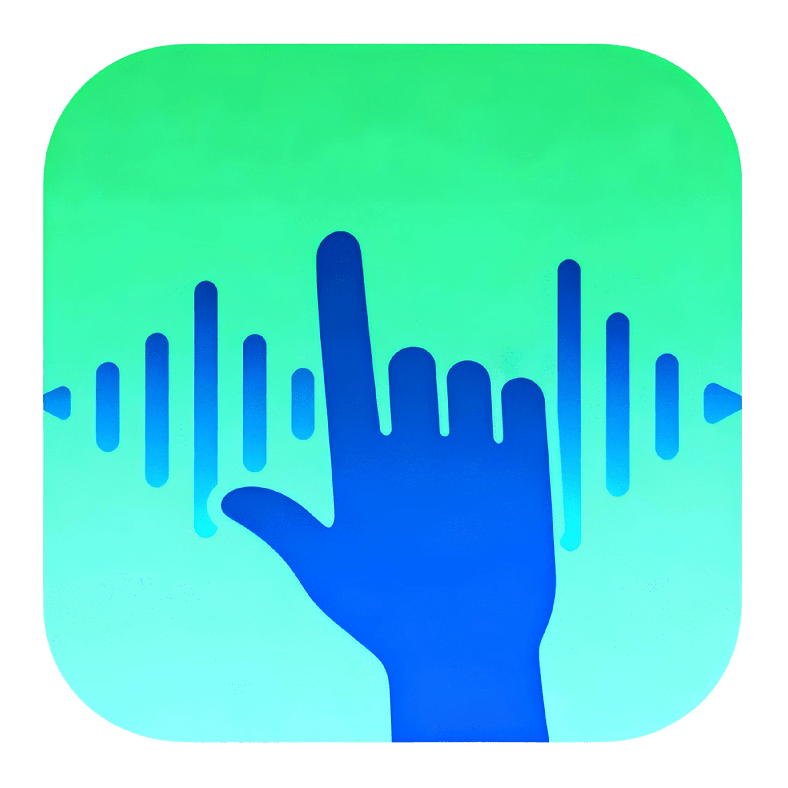
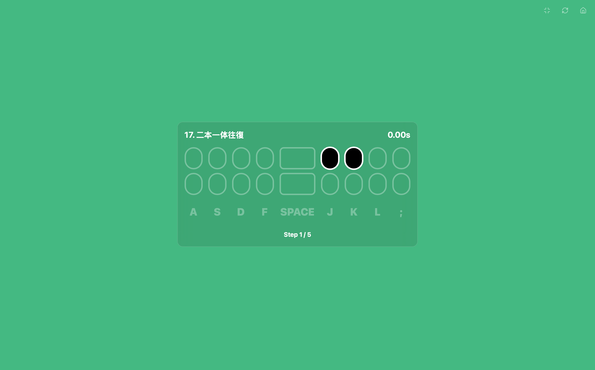
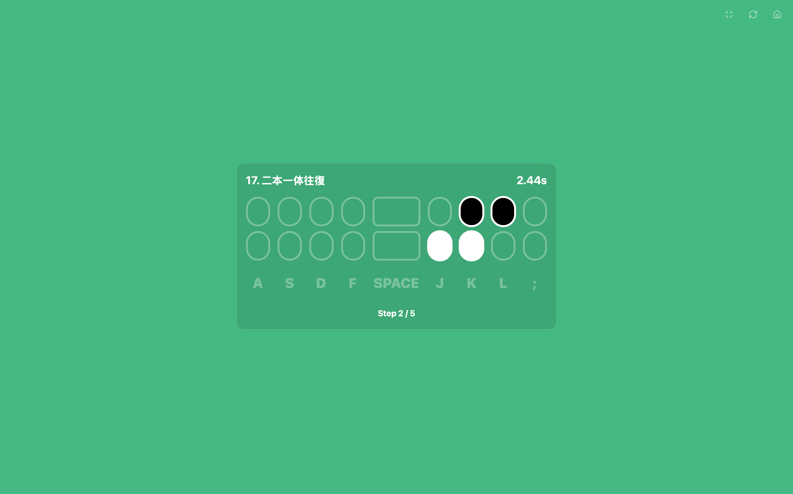
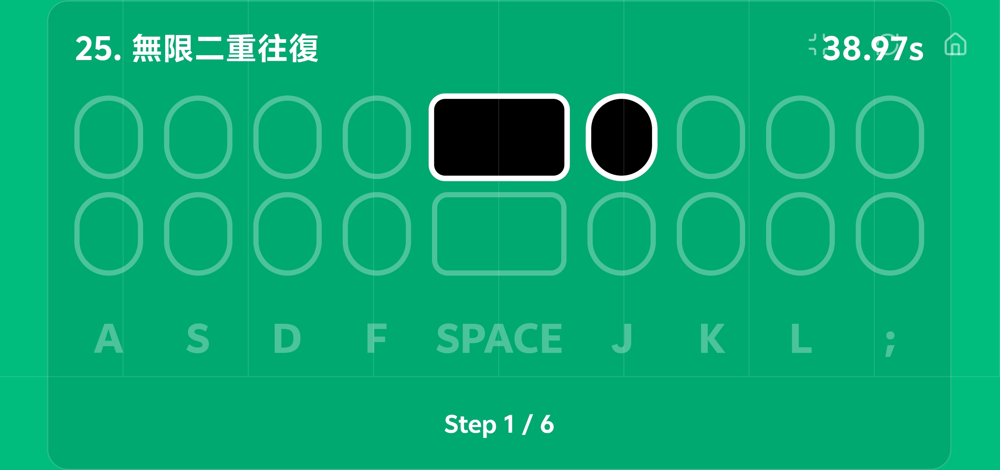
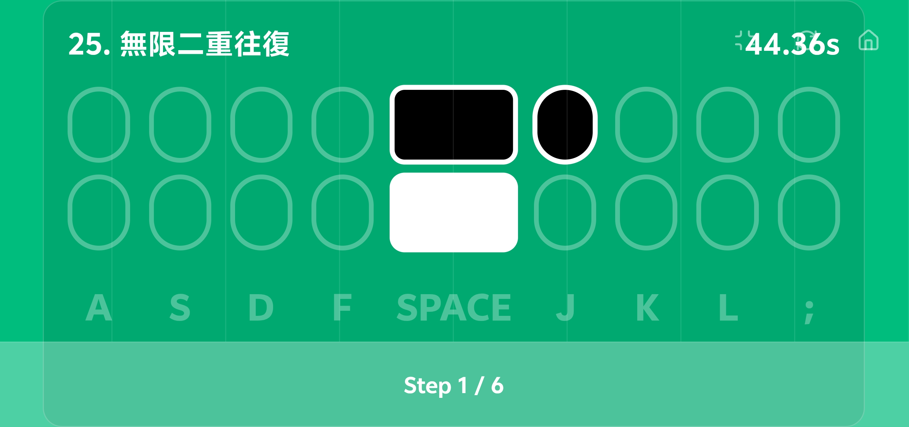

<div align="right">
[中文](./README.md) | English
</div>

<div align="center">



# Finger Dancer

**A web-based music rhythm game designed to provide a smooth and fun music experience through keyboard or touch operations.**

</div>

<div align="center">

[](https://reactjs.org/)
[](https://vitejs.dev/)
[](https://jotai.org/)
[](https://tonejs.github.io/)
[](https://tailwindcss.com/)
[](https://opensource.org/licenses/MIT)
[](http://fd.isok.dev)

<div align="center">
  <a href="https://app.netlify.com/start/deploy?repository=https%3A%2F%2Fgithub.com%2Ffaithleysath%2FFingerDancer">
    
  </a>
  <a href="https://vercel.com/new/clone?repository-url=https%3A%2F%2Fgithub.com%2Ffaithleysath%2FFingerDancer">
    
  </a>
</div>

</div>

**Finger Dancer** is an open-source music rhythm game inspired by [Fingerdance](https://store.steampowered.com/app/3633450/Fingerdance/). Built with modern web technologies, it aims to provide a responsive, visually appealing, and highly customizable gaming experience. Whether you&#39;re using a keyboard on a desktop or touching the screen on a mobile device, you can enjoy the fun of tapping notes to the rhythm.

## 📖 Table of Contents

* [Core Features](#-core-features)
* [Tech Stack](#-tech-stack)
* [Getting Started](#-getting-started)
* [Project Structure](#-project-structure)
* [Screenshots](#-screenshots)
* [Contributing](#-contributing)
* [License](#-license)

## ✨ Core Features

*   **🎹 Dynamic Scale System**
    *   Built-in multiple musical scales (e.g., C Major, Pentatonic, Blues), producing harmonious musical feedback with every key press.
    *   Supports custom scales, allowing you to create your own musical themes.

*   **📱 Cross-Platform Compatibility**
    *   Perfectly adapted for desktop keyboard operations (A, S, D, F, Space, J, K, L, ;).
    *   Provides a full-screen touch overlay for mobile devices, simulating a real keyboard experience.

*   **🚀 Modern Web Tech**
    *   Built with React 19 and Vite (Rolldown) for a lightning-fast development experience and excellent performance.
    *   Uses Jotai for state management, resulting in clean and easy-to-maintain code.
    *   Leverages Tone.js for high-quality Web Audio synthesis.

*   **🎨 Customizable UI**
    *   Built with Tailwind CSS for a beautiful and responsive interface.
    *   Easily extend and customize the game&#39;s appearance through a simple component-based design.

## 🛠️ Tech Stack

*   **Frontend Framework:** [React 19](https://reactjs.org/)
*   **Build Tool:** [Vite (Rolldown)](https://vitejs.dev/)
*   **State Management:** [Jotai](https://jotai.org/)
*   **Audio Synthesis:** [Tone.js](https://tonejs.github.io/)
*   **UI/Styling:** [Tailwind CSS](https://tailwindcss.com/)
*   **Language:** [TypeScript](https://www.typescriptlang.org/)

## 🚀 Getting Started

1.  Clone the repository:
    ```bash
    git clone https://github.com/faithleysath/FingerDancer.git
    ```
2.  Install dependencies:
    ```bash
    cd FingerDancer
    bun install
    ```
3.  Run the development server:
    ```bash
    bun run dev
    ```
4.  Build for production:
    ```bash
    bun run build
    ```

## 📂 Project Structure

```
src
├── atoms/         # Jotai atoms (global state)
├── components/    # React components
├── hooks/         # Custom React Hooks
├── lib/           # Core libraries (e.g., audio.ts)
└── App.tsx        # Application main entry point
```

## 🤝 Contributing

We welcome all forms of contributions!

1.  Fork this repository
2.  Create your feature branch (`git checkout -b feature/YourFeature`)
3.  Commit your changes (`git commit -m &#39;Add some YourFeature&#39;`)
4.  Push to the branch (`git push origin feature/YourFeature`)
5.  Open a Pull Request

## ⚖️ License

This project is licensed under the [MIT License](https://opensource.org/licenses/MIT).

## 📸 Screenshots

**Desktop**

| Game Screen 1 | Game Screen 2 |
| :---: | :---: |
|  |  |

**Mobile**

| Game Screen 1 | Game Screen 2 |
| :---: | :---: |
|  |  |

## Star History

[](https://app.repohistory.com/star-history)

## Stargazers over time

[](https://starchart.cc/faithleysath/FingerDancer)
