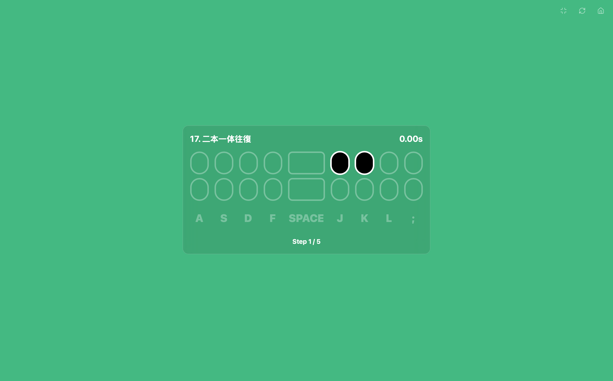
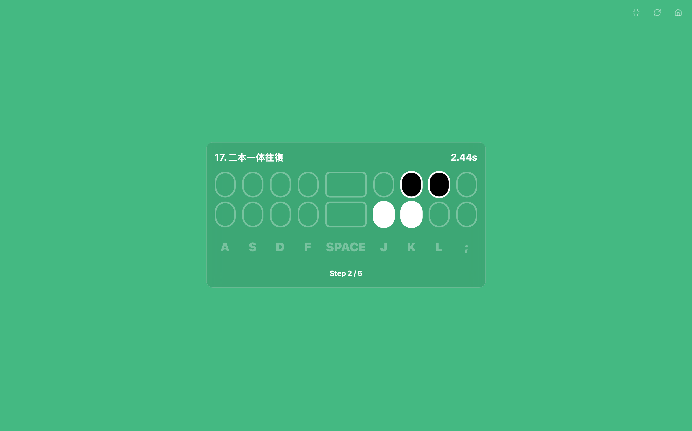

<div align="center">


# Finger Dancer

**一个基于 Web 的音乐节奏游戏，旨在通过键盘或触摸操作，提供流畅、有趣的音乐体验。**

</div>

<div align="center">

[](https://reactjs.org/)
[](https://vitejs.dev/)
[](https://jotai.org/)
[](https://tonejs.github.io/)
[](https://tailwindcss.com/)

<div align="center">
  <a href="http://fd.isok.dev">
    
  </a>
  <a href="https://app.netlify.com/start/deploy?repository=https%3A%2F%2Fgithub.com%2Ffaithleysath%2FFingerDancer">
    
  </a>
  <a href="https://vercel.com/new/clone?repository-url=https%3A%2F%2Fgithub.com%2Ffaithleysath%2FFingerDancer">
    
  </a>
<div align="center">

中文 | [English](./README.en.md)

</div>

**Finger Dancer** 是一个开源的音乐节奏游戏，灵感来源于[《Fingerdance》](https://store.steampowered.com/app/3633450/Fingerdance/)。它使用现代 Web 技术构建，旨在提供一个响应迅速、视觉吸引力强且高度可定制的游戏体验。无论你是在桌面设备上使用键盘，还是在移动设备上触摸屏幕，都可以享受到跟随节奏敲击音符的乐趣。

## 📖 目录

* [核心特性](#-核心特性)
* [技术栈](#-技术栈)
* [快速开始](#-快速开始)
* [项目结构](#-项目结构)
* [截图](#-截图)
* [贡献指南](#-贡献指南)
* [许可证](#-许可证)

## ✨ 核心特性

*   **🎹 动态音阶系统 (Dynamic Scale System)**
    *   内置多种音乐音阶（如 C 大调、五声音阶、布鲁斯等），每次按键都会产生和谐的音乐反馈。
    *   支持用户自定义音阶，创造属于你自己的音乐主题。

*   **📱 跨平台兼容 (Cross-Platform Compatibility)**
    *   完美适配桌面键盘操作（A, S, D, F, Space, J, K, L, ;）。
    *   为移动设备提供全屏触摸覆盖层，模拟真实的键盘按键体验。

*   **🚀 现代 Web 技术 (Modern Web Tech)**
    *   使用 React 19 和 Vite (Rolldown) 构建，提供极速的开发体验和优异的性能。
    *   采用 Jotai 进行状态管理，代码简洁且易于维护。
    *   利用 Tone.js 实现高质量的 Web Audio 合成。

*   **🎨 可定制界面 (Customizable UI)**
    *   使用 Tailwind CSS 构建，界面美观且响应式。
    *   通过简单的组件化设计，可以轻松扩展和定制游戏外观。

## 🛠️ 技术栈

*   **前端框架:** [React 19](https://reactjs.org/)
*   **构建工具:** [Vite (Rolldown)](https://vitejs.dev/)
*   **状态管理:** [Jotai](https://jotai.org/)
*   **音频合成:** [Tone.js](https://tonejs.github.io/)
*   **UI/样式:** [Tailwind CSS](https://tailwindcss.com/)
*   **语言:** [TypeScript](https://www.typescriptlang.org/)

## 🚀 快速开始

1.  克隆仓库：
    ```bash
    git clone https://github.com/faithleysath/FingerDancer.git
    ```
2.  安装依赖：
    ```bash
    cd FingerDancer
    bun install
    ```
3.  运行开发服务器：
    ```bash
    bun run dev
    ```
4.  构建生产版本：
    ```bash
    bun run build
    ```

## 📂 项目结构

```
src
├── atoms/         # Jotai atoms (全局状态)
├── components/    # React 组件
├── hooks/         # 自定义 React Hooks
├── lib/           # 核心库 (例如 audio.ts)
└── App.tsx        # 应用主入口
```

## 🤝 贡献指南

我们欢迎所有形式的贡献！

1.  Fork 本仓库
2.  创建你的特性分支 (`git checkout -b feature/YourFeature`)
3.  提交你的更改 (`git commit -m 'Add some YourFeature'`)
4.  推送到分支 (`git push origin feature/YourFeature`)
5.  提交一个 Pull Request

## ⚖️ 许可证

本项目采用 [MIT 许可证](https://opensource.org/licenses/MIT)。

## 📸 截图

**桌面端**

| 游戏界面 1 | 游戏界面 2 |
| :---: | :---: |
|  |  |

**移动端**

| 游戏界面 1 | 游戏界面 2 |
| :---: | :---: |
|  |  |

## Star History

[](https://app.repohistory.com/star-history)

## Stargazers over time

[](https://starchart.cc/faithleysath/FingerDancer)
